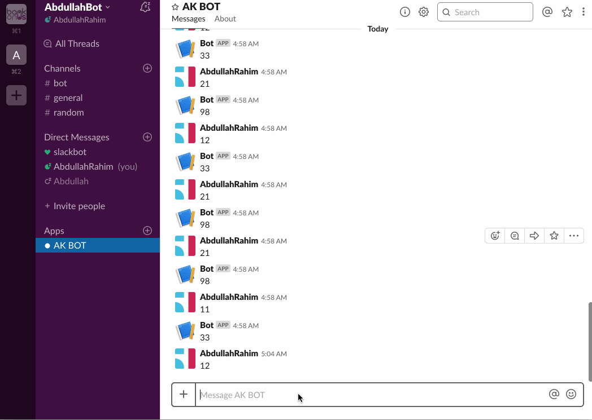

# ak-test-app
This is a test to build Slack Bot App

##Deployment and Testing Steps:

1. Change .env file. 

SLACK_CLIENT_ID=*** (Slack Client ID) 
SLACK_SECRET=*** (Secret key got from the channel creation). 
SLACK_REDIRECT_URI=http://abdullahrahim.me:8000/slack/connect (This is the  endpoint of your app where slack will redirect to send oath token (if its necessary) )  
SLACK_BOT_TOKEN=*** (removed as i pushed on git and received message from slack :))  

Followed the Slack Documentation.

https://api.slack.com/events-api

2. You will need to create an app for your workspace on slack.  

When you will be done  creating app, you have to enter **Redirect URL** under **OAuth & Permissions** left menu.

Copy the **Bot User OAuth Access Token** TO .env **SLACK_BOT_TOKEN** key from the same **OAuth & Permissions** menu.

Copy **CLIENT ID** and **CLIENT SECRET** from Basic Info Tab of **settings** menu (App Credentials)

Run the application and Put you URL of your application append **"/calculate"** in the url 
https://api.slack.com/apps/{YOUR_APP_ID}/event-subscriptions?

If you want to just test this app, you can be added to my workspace that is 
 
**https://abdullahbot1.slack.com**

## Deployment 

I set up CI to deploy this app using Jenkins. But it is running on simple php inbuild server 
(php -S abdullahrahim.me:8000 -t public) but it fetches the code from git repository.

## Docker 
Work is in progress. If needed I can do it. I started in the beginning but stopped due to lack of time
 

Hurray!!
See It in Action
